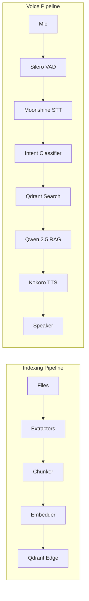

# LocalLens

**Search your files by talking to them — 100% offline**


<!-- Demo GIF coming soon -->

## What It Does

- **Semantic file indexing** — indexes your local documents into a vector database for meaning-based search
- **CLI & voice search** — find files via command-line queries or natural speech
- **RAG Q&A** — ask questions about your documents and get grounded answers from a local LLM

## Architecture



## Stack

| Component | Choice |
|-----------|--------|
| Vector DB | Qdrant Edge (embedded, on-disk) |
| Embeddings | `all-MiniLM-L6-v2` via sentence-transformers (384-dim) |
| LLM | Ollama with `qwen2.5:3b` (Q4_K_M) |
| STT | Moonshine v2 base via `moonshine-voice` |
| TTS | Kokoro-82M via `kokoro-onnx` |
| VAD | Silero VAD (bundled with moonshine-voice) |
| CLI | Typer + Rich |
| Audio I/O | sounddevice + numpy |

## Quickstart

### Prerequisites

- Python 3.11+
- [Ollama](https://ollama.ai) installed and running (for `ask` and `voice` commands)

```bash
# Pull the LLM model
ollama pull qwen2.5:3b

# Install LocalLens (core)
pip install -e .

# Or with voice support
pip install -e ".[voice]"
```

### Usage

```bash
# Index your documents
locallens index ~/Documents

# Semantic search
locallens search "quarterly revenue report"

# Ask questions (requires Ollama)
locallens ask "What did the Q3 report say about revenue?"

# Voice mode (requires voice dependencies)
locallens voice

# View stats
locallens stats
```

## Memory Usage

| Component | RAM |
|-----------|-----|
| macOS | ~4 GB |
| Embeddings (all-MiniLM-L6-v2) | ~0.15 GB |
| Qdrant (mmap, disk-based) | ~0.05 GB |
| LLM (Ollama qwen2.5:3b) | ~2.2 GB |
| STT (Moonshine) | ~0.2 GB |
| TTS (Kokoro) | ~0.5 GB |
| App overhead | ~0.5 GB |
| **Total** | **~7.6 GB** |

Leaves ~8.4 GB headroom on a 16 GB machine.

## Supported File Types

| Type | Extensions |
|------|-----------|
| Text | `.txt`, `.md` |
| Documents | `.pdf`, `.docx` |
| Code | `.py`, `.js`, `.ts`, `.go`, `.rs`, `.java`, `.c`, `.cpp`, `.rb` |

## How It Works

1. **Indexing** — Files are recursively discovered, text is extracted using format-specific extractors, split into ~500-character overlapping chunks, embedded into 384-dimensional vectors, and stored in Qdrant Edge (local, no server needed).

2. **Search** — Your query is embedded into the same vector space and matched against stored chunks using cosine similarity. Results are ranked by relevance.

3. **Ask (RAG)** — Relevant chunks are retrieved and assembled into a context prompt. Ollama's `qwen2.5:3b` generates a grounded answer that only uses information from your files.

4. **Voice** — Silero VAD detects speech boundaries, Moonshine v2 transcribes in real-time, intent is classified (search vs. question), the appropriate pipeline runs, and Kokoro TTS speaks the response.

## License

MIT
