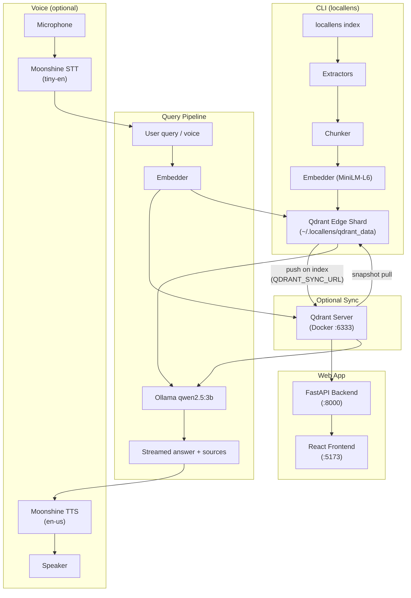

<p align="center">
  
</p>

**Search your files by talking to them - 100% offline**


<!-- Screenshot placeholder - replace with actual screenshot after make dev -->

## What It Does

- **Semantic search** - index local files and find them by meaning, not just keywords
- **RAG Q&A** - ask natural-language questions, get grounded answers from a local LLM
- **Voice input + playback** - speak your question, hear the answer (optional)
- **CLI + web app** - fast Typer CLI for power users, React UI for visual browsing
- **Offline-first** - everything runs on your machine, no cloud APIs, no telemetry

## Architecture



**Two stores, one schema.** The CLI uses [Qdrant Edge](https://qdrant.tech/documentation/edge/) (`qdrant-edge-py`) for embedded, on-device vector search - no server needed. The web app talks to a Dockerized Qdrant server via `qdrant-client`. Both use the same named vector (`"text"`, 384-dim, cosine) and keyword payload indexes, so points sync cleanly between them. See the [/stack page](http://localhost:5173/stack) in the running app for a feature-by-feature breakdown.

## Stack

| Component | Choice |
|---|---|
| CLI vector store | [Qdrant Edge](https://qdrant.tech/documentation/edge/) via `qdrant-edge-py` (embedded, on-device) |
| Web backend store | Qdrant server (`qdrant/qdrant:v1.14.0`, Docker) via `qdrant-client` |
| CLI ↔ server sync | Push on index + snapshot pull (`locallens/sync.py`) |
| Embeddings | `all-MiniLM-L6-v2` via sentence-transformers (384-dim, cosine) |
| LLM | Ollama with `qwen2.5:3b` (Q4_K_M quantized, ~2.2 GB RAM) |
| STT | Moonshine `tiny-en` via `moonshine-voice` (bundled assets) |
| TTS | Moonshine TextToSpeech (`en-us`) via `moonshine-voice` |
| Backend | FastAPI - WebSockets for index progress, SSE for answer streaming |
| Frontend | React 19 + Vite 8 + Tailwind 4 + shadcn/base-ui |
| CLI | Typer + Rich |

## Quickstart

### Prerequisites

- Python 3.11+
- [Ollama](https://ollama.ai) installed and running
- Docker + Docker Compose (only for the web app)

```bash
ollama pull qwen2.5:3b
pip install -e .              # core CLI
pip install -e ".[voice]"     # + voice support (optional)
```

### CLI only (fully offline, no Docker)

```bash
locallens index ~/Documents
locallens search "quarterly revenue report"
locallens search "authentication" --file-type .py
locallens ask "What did the Q3 report say about revenue?"
locallens stats
```

### Web app

```bash
make setup    # first run: Qdrant container + deps
make dev      # Qdrant :6333, uvicorn :8000, Vite :5173
```

Open http://localhost:5173. Pages: **Dashboard** (stats), **Index** (folder picker + progress), **Search** (filtered), **Ask** (chat with voice), **Stack** (architecture docs).

### CLI + web sharing one index

```bash
export QDRANT_SYNC_URL=http://localhost:6333
locallens index ~/Documents    # dual-writes to local shard AND Docker Qdrant
```

The web app sees everything the CLI indexes - instantly, no extra step. See [Sync commands](#sync) below for manual push/pull.

## How It Works

### 1. Indexing

Files are recursively discovered, text extracted (PyMuPDF for PDF, python-docx for DOCX, raw read for text/code), split into ~500-character overlapping chunks at word boundaries, embedded into 384-dim vectors, and stored in Qdrant Edge. Each chunk gets a deterministic UUID5 id, and dedup is O(1) via a keyword payload index on the file's SHA-256 hash.

### 2. Search

Your query is embedded into the same vector space and matched via cosine similarity. Optional filters (e.g. `--file-type .pdf`) run server-side against keyword payload indexes. The web app exposes a file-type dropdown that triggers the same filter.

### 3. Retrival Augmented Generation

Top-k relevant chunks are retrieved and assembled into a context prompt. Ollama's `qwen2.5:3b` generates a grounded answer constrained to only use the retrieved context. Responses stream token-by-token via SSE. Source files are attached to each answer.

### 4. Voice

On the Ask page, click the mic button to record. The browser captures webm/opus via MediaRecorder, the backend decodes it through ffmpeg, and Moonshine `tiny-en` transcribes it. The transcript is auto-sent through the same RAG pipeline. Click the speaker icon on any assistant message to hear it via Moonshine TTS.

### 5. Sync

<a name="sync"></a>

| Command | What it does |
|---|---|
| `locallens index ~/docs` (with `QDRANT_SYNC_URL` set) | Dual-write: local Edge shard + remote Qdrant server |
| `locallens sync push` | Push all local points to the server (catch-up after offline indexing) |
| `locallens sync pull` | Download a full server snapshot into the local shard |
| `locallens sync pull --incremental` | Transfer only changed segments (keeps warm shard warm) |

## Some Features

LocalLens leverages these Qdrant Edge capabilities (documented live at [/stack](http://localhost:5173/stack)):

| Feature | How we use it |
|---|---|
| Named vectors | Both stores declare vector `"text"` - schema-compatible sync |
| Keyword payload indexes | O(1) dedup via `file_hash` index, scoped search via `file_type` |
| Filtered search | `--file-type .pdf` on CLI, dropdown on web - single indexed query |
| Facets | Stats page and `locallens stats` get file-type breakdowns server-side |
| Push sync (dual-write) | `locallens index` writes locally and uploads to the Docker Qdrant |
| Snapshot pull | `locallens sync pull` restores a shard from a server snapshot |
| Partial snapshot | `--incremental` flag transfers only changed segments |
| Optimizer tuning | Eager vacuum for personal-corpus re-indexing patterns |

## Memory Usage

| Component | RAM |
|---|---|
| Embeddings (all-MiniLM-L6-v2) | ~150 MB |
| Qdrant Edge shard | ~50 MB |
| LLM (Ollama qwen2.5:3b) | ~2.2 GB |
| STT (Moonshine tiny-en) | ~200 MB |
| TTS (Moonshine en-us) | ~500 MB |
| App overhead | ~500 MB |
| **Total (with voice)** | **~3.6 GB** |
| **Total (without voice)** | **~2.9 GB** |

## Supported File Types

| Type | Extensions |
|---|---|
| Text | `.txt`, `.md` |
| Documents | `.pdf`, `.docx` |
| Code | `.py`, `.js`, `.ts`, `.go`, `.rs`, `.java`, `.c`, `.cpp`, `.rb` |

## Upgrading from pre-Edge versions

Earlier versions used `qdrant-client`'s legacy embedded mode (incompatible storage format):

```bash
rm -rf ~/.locallens/qdrant_data
docker compose down -v && docker compose up -d qdrant
locallens index ~/Documents
```

## License

MIT
