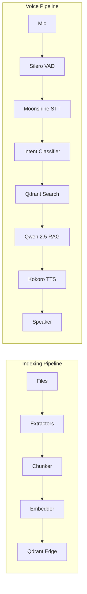

# LocalLens

**Search your files by talking to them — 100% offline**


<!-- Demo GIF coming soon -->

## What It Does

- **Semantic file indexing** — indexes your local documents into a vector database for meaning-based search
- **CLI & voice search** — find files via command-line queries or natural speech
- **RAG Q&A** — ask questions about your documents and get grounded answers from a local LLM

## Architecture



## Stack

| Component | Choice |
|-----------|--------|
| CLI vector store | [Qdrant Edge](https://qdrant.tech/documentation/edge/) via `qdrant-edge-py` (embedded, on-device) |
| Web backend store | Qdrant server (`qdrant/qdrant:v1.14.0`, Docker) via `qdrant-client` |
| CLI ↔ server sync | Push on index + snapshot pull — see `locallens/sync.py` |
| Embeddings | `all-MiniLM-L6-v2` via sentence-transformers (384-dim, cosine) |
| Named vector | `"text"` — same key on both sides for schema-compatible sync |
| LLM | Ollama with `qwen2.5:3b` (Q4_K_M) |
| STT | Moonshine `tiny-en` via `moonshine-voice` |
| TTS | Moonshine TextToSpeech (`en-us`) via `moonshine-voice` |
| CLI | Typer + Rich |
| Backend | FastAPI (async), WebSockets for index progress, SSE for ask streaming |
| Frontend | React 19 + Vite 8 + Tailwind 4 + shadcn/base-ui |

Curious which Qdrant Edge features LocalLens actually leverages? The running
app has an **/stack** page that documents every feature inline with the real
call sites — open <http://localhost:5173/stack> after `make dev`.

## Quickstart

### Prerequisites

- Python 3.11+
- [Ollama](https://ollama.ai) installed and running (for `ask` and `voice` commands)
- Docker + Docker Compose (for the web app — optional if you only use the CLI)

```bash
# Pull the LLM model
ollama pull qwen2.5:3b

# Install LocalLens (core)
pip install -e .

# Or with voice support
pip install -e ".[voice]"
```

### Usage — CLI only (fully offline)

```bash
# Index your documents
locallens index ~/Documents

# Semantic search (optionally scoped by file type)
locallens search "quarterly revenue report"
locallens search "authentication" --file-type .py

# Ask questions (requires Ollama)
locallens ask "What did the Q3 report say about revenue?"

# View stats (includes a file-type facet breakdown from Qdrant Edge)
locallens stats
```

### Usage — CLI + web app (push-sync to a shared Qdrant)

```bash
# Start the web stack (Qdrant + FastAPI + Vite)
make setup   # first run only
make dev

# Point the CLI at the Docker Qdrant and index. Each batch is dual-written
# to the local Edge shard AND pushed to the server, so the web app at
# http://localhost:5173 sees the same data instantly.
export QDRANT_SYNC_URL=http://localhost:6333
locallens index ~/Documents

# If you index without sync enabled and want the server to catch up:
locallens sync push

# Restore the local shard from a server snapshot (e.g. on a new machine):
locallens sync pull
locallens sync pull --incremental   # only transfer changed segments
```

### Upgrading from the pre-Edge embedded store

Earlier versions of LocalLens used `qdrant-client`'s legacy embedded mode,
which isn't compatible with the new Qdrant Edge storage format. If you have
an existing local index:

```bash
rm -rf ~/.locallens/qdrant_data       # old qdrant-client format
docker compose down -v                # drop the old unnamed-vector collection
docker compose up -d qdrant
locallens index ~/Documents           # rebuild
```

## Memory Usage

| Component | RAM |
|-----------|-----|
| macOS | ~4 GB |
| Embeddings (all-MiniLM-L6-v2) | ~0.15 GB |
| Qdrant (mmap, disk-based) | ~0.05 GB |
| LLM (Ollama qwen2.5:3b) | ~2.2 GB |
| STT (Moonshine) | ~0.2 GB |
| TTS (Kokoro) | ~0.5 GB |
| App overhead | ~0.5 GB |
| **Total** | **~7.6 GB** |

Leaves ~8.4 GB headroom on a 16 GB machine.

## Supported File Types

| Type | Extensions |
|------|-----------|
| Text | `.txt`, `.md` |
| Documents | `.pdf`, `.docx` |
| Code | `.py`, `.js`, `.ts`, `.go`, `.rs`, `.java`, `.c`, `.cpp`, `.rb` |

## How It Works

1. **Indexing** — Files are recursively discovered, text is extracted using format-specific extractors, split into ~500-character overlapping chunks, embedded into 384-dimensional vectors, and stored in Qdrant Edge (local, no server needed).

2. **Search** — Your query is embedded into the same vector space and matched against stored chunks using cosine similarity. Results are ranked by relevance.

3. **Ask (RAG)** — Relevant chunks are retrieved and assembled into a context prompt. Ollama's `qwen2.5:3b` generates a grounded answer that only uses information from your files.

4. **Voice** — Silero VAD detects speech boundaries, Moonshine v2 transcribes in real-time, intent is classified (search vs. question), the appropriate pipeline runs, and Kokoro TTS speaks the response.

## License

MIT
