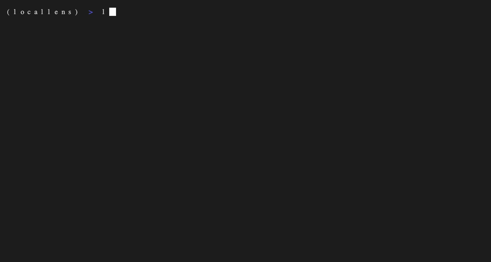
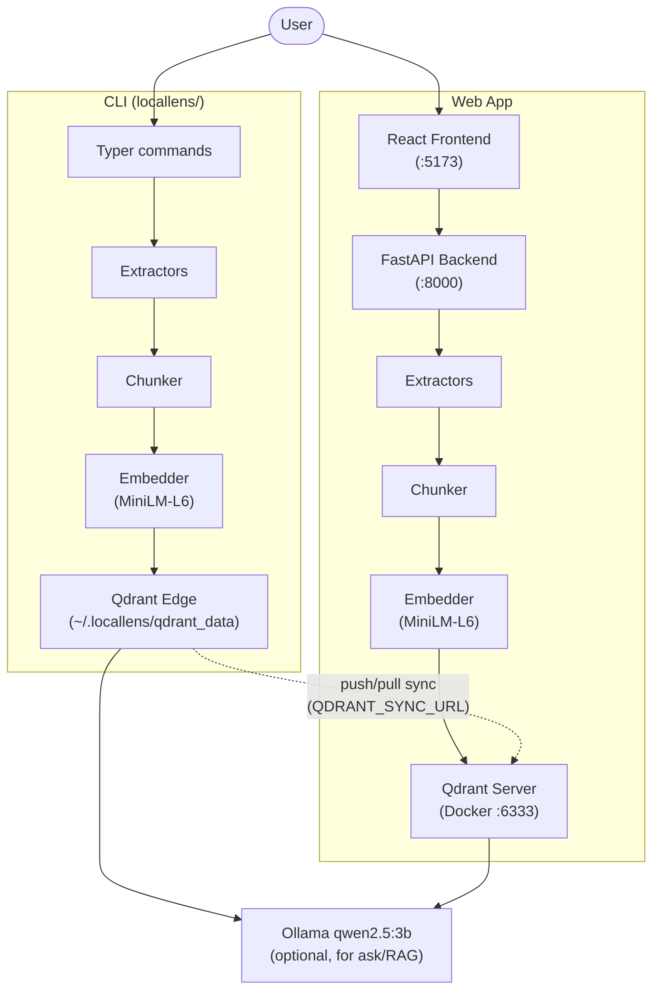

<p align="center">
  
</p>

**Search your files by talking to them - 100% offline**




## What It Does

- **Semantic + keyword search** - find files by meaning or exact match with hybrid retrieval (RRF)
- **RAG Q&A** - ask natural-language questions, get grounded answers from a local LLM
- **Voice input + playback** - speak your question, hear the answer (Moonshine STT + Piper TTS)
- **CLI + web app** - fast Typer CLI for power users, React UI for visual browsing
- **Watch mode** - auto-indexes new and modified files as you work
- **Namespaces** - isolate collections per project, switch between them in the UI
- **Plugin extractors** - extend with custom file formats via Python entry points
- **Offline-first** - everything runs on your machine, no cloud APIs, no telemetry

## Quickstart

### Prerequisites

- Python 3.11+
- [Ollama](https://ollama.ai) installed and running
- Docker + Docker Compose (for the web app)
- Node.js 18+ (for the frontend)

### Web app (3 steps)

```bash
git clone https://github.com/mahimai/ask-local-files.git && cd ask-local-files
make setup    # starts Qdrant container, pulls Ollama model, installs deps
make dev      # Qdrant :6333, uvicorn :8000, Vite :5173
```

Open http://localhost:5173. Pages: **Dashboard** (stats), **Index** (folder picker + progress + watch toggle), **Search** (hybrid/semantic/keyword + filters), **Ask** (chat with voice), **Stack** (architecture docs).

### CLI only (no Docker needed)

```bash
pip install -e .
locallens doctor            # verify setup
locallens index ~/Documents
locallens search "meeting notes from last week"
locallens ask "What did the Q3 report say about revenue?"
```

### CLI + web sharing one index

```bash
export QDRANT_SYNC_URL=http://localhost:6333
locallens index ~/Documents    # dual-writes to local shard AND Docker Qdrant
```

The web app sees everything the CLI indexes -- instantly, no extra step. See [Sync commands](#sync) below for manual push/pull.

## Architecture



**Two stores, one schema.** The CLI uses [Qdrant Edge](https://qdrant.tech/documentation/edge/) (`qdrant-edge-py`) for embedded, on-device vector search -- no server needed. The web app talks to a Dockerized Qdrant server via `qdrant-client`. Both use the same named vector (`"text"`, 384-dim, cosine) and keyword payload indexes, so points sync cleanly between them. See the [/stack page](http://localhost:5173/stack) in the running app for a feature-by-feature breakdown.

### Directory layout

| Directory | Description |
|---|---|
| `locallens/` | Typer CLI tool (pip-installable, uses Qdrant Edge) |
| `backend/` | FastAPI web API (uses Qdrant Server via Docker) |
| `frontend/` | React 19 + Vite + Tailwind web app |
| `tests/` | Pytest test suite (pipeline, API, integration) |
| `assets/` | Logo and static assets |

## Stack

| Component | Choice |
|---|---|
| CLI vector store | [Qdrant Edge](https://qdrant.tech/documentation/edge/) via `qdrant-edge-py` (embedded, on-device) |
| Web backend store | Qdrant server (`qdrant/qdrant:v1.14.0`, Docker) via `qdrant-client` |
| CLI <-> server sync | Push on index + snapshot pull (`locallens/sync.py`) |
| Embeddings | `all-MiniLM-L6-v2` via sentence-transformers (384-dim, cosine) |
| Keyword search | `rank-bm25` (in-memory, persisted to JSON) |
| LLM | Ollama with `qwen2.5:3b` (Q4_K_M quantized, ~2.2 GB RAM) |
| STT | Moonshine `tiny-en` via `moonshine-voice` (bundled assets) |
| TTS | Piper `en_US-lessac-medium` via `piper-tts` (ONNX, auto-downloaded) |
| Backend | FastAPI -- WebSockets for index progress, SSE for answer streaming |
| Frontend | React 19 + Vite 8 + Tailwind 4 + shadcn/base-ui |
| CLI | Typer + Rich |

## How It Works

### 1. Indexing

Files are recursively discovered, text extracted via a pluggable extractor system (PyMuPDF for PDF with OCR fallback, python-docx for DOCX, openpyxl for spreadsheets, LiteParse when installed for higher quality). Text is split using an adaptive chunker that respects document structure: headings in markdown, function/class boundaries in code, paragraphs in documents, sheets in spreadsheets. Chunks are embedded into 384-dim vectors and stored in both the Qdrant vector index and an in-memory BM25 keyword index. Each chunk gets a deterministic UUID5 id, and dedup is O(1) via a keyword payload index on the file's SHA-256 hash.

### 2. Search

Hybrid by default: your query runs through both semantic (cosine similarity in Qdrant) and keyword (BM25) retrieval, combined via Reciprocal Rank Fusion (RRF, k=60). You can switch to pure semantic or pure keyword mode. Optional filters -- file type, path prefix, date range -- run server-side against keyword payload indexes. The web UI exposes dropdowns and date pickers for all filters.

### 3. Retrieval Augmented Generation

Top-k relevant chunks are retrieved and assembled into a context prompt. Ollama's `qwen2.5:3b` generates a grounded answer constrained to only use the retrieved context. Responses stream token-by-token via SSE. Source files are attached to each answer.

### 4. Voice

On the Ask page, click the mic button to record. The browser captures webm/opus via MediaRecorder, the backend decodes it through ffmpeg, and Moonshine `tiny-en` transcribes it. The transcript is auto-sent through the same RAG pipeline. Each assistant message has an inline "Listen" button that synthesizes audio via Piper TTS with visual playback state (loading, playing with animated bars, stop).

### 5. Watch Mode

The backend runs a filesystem watcher (watchdog) as a background thread. When files are created or modified, they're re-indexed automatically within seconds. Deleted files have their points removed from Qdrant. The CLI offers `locallens watch <folder>` for the same behavior with Rich terminal output. The web UI has a watch toggle per indexed folder.

### 6. Sync

<a name="sync"></a>

| Command | What it does |
|---|---|
| `locallens index ~/docs` (with `QDRANT_SYNC_URL` set) | Dual-write: local Edge shard + remote Qdrant server |
| `locallens sync push` | Push all local points to the server (catch-up after offline indexing) |
| `locallens sync pull` | Download a full server snapshot into the local shard |
| `locallens sync pull --incremental` | Transfer only changed segments (keeps warm shard warm) |

### 7. Namespaces

Collections are isolated by namespace. The default namespace maps to the existing `locallens` collection for backward compatibility. Create new namespaces via the sidebar dropdown or `--namespace` CLI flag to keep projects separate.

```bash
locallens index ~/work --namespace work
locallens index ~/personal --namespace personal
locallens search "budget" --namespace work
```

### 8. Authentication (optional)

Set `LOCALLENS_API_KEY` in `.env` to require `Authorization: Bearer <key>` on all API endpoints. When unset, everything is open (default). Per-namespace access control is available via `~/.locallens/access.json` mapping keys to allowed namespaces. The frontend Settings page stores the key in localStorage.

## Supported File Types

| Type | Extensions | Extractor |
|---|---|---|
| Text | `.txt`, `.md` | TextExtractor (UTF-8/latin-1 fallback) |
| Obsidian vaults | `.md` (in `.obsidian/` dirs) | ObsidianExtractor (strips frontmatter, resolves wikilinks) |
| Documents | `.pdf`, `.docx`, `.pptx`, `.html` | PdfExtractor (pymupdf + OCR fallback), DocxExtractor, or LiteParse |
| Spreadsheets | `.xlsx`, `.xls`, `.csv`, `.tsv` | SpreadsheetExtractor (openpyxl / stdlib csv) |
| Code | `.py`, `.js`, `.ts`, `.go`, `.rs`, `.java`, `.c`, `.cpp`, `.rb` | CodeExtractor |
| Email | `.eml`, `.msg` | EmailExtractor (stdlib email / python-oletools) |
| Ebooks | `.epub` | EpubExtractor (ebooklib) |

### Plugin Extractors

Third-party packages can register custom extractors via the `locallens.extractors` entry-point group:

```toml
# in your package's pyproject.toml
[project.entry-points."locallens.extractors"]
my_format = "my_package.extractor:MyExtractor"
```

Your class must inherit from `locallens.extractors.base.LocalLensExtractor` and implement `supported_extensions()`, `extract()`, and `name()`.

## Optional Dependencies

```bash
pip install -e ".[voice]"      # Moonshine STT + Piper TTS + sounddevice
pip install -e ".[parsing]"    # LiteParse + openpyxl (better doc parsing)
pip install -e ".[ocr]"        # pytesseract + Pillow (OCR for scanned PDFs)
pip install -e ".[watch]"      # watchdog (filesystem watcher for CLI)
pip install -e ".[email]"      # python-oletools (for .msg files)
pip install -e ".[ebooks]"     # ebooklib (for .epub files)
pip install -e ".[dev]"        # pytest + pytest-asyncio + ruff
```

## Qdrant Edge Features

LocalLens leverages these Qdrant Edge capabilities (documented live at [/stack](http://localhost:5173/stack)):

| Feature | How we use it |
|---|---|
| Named vectors | Both stores declare vector `"text"` -- schema-compatible sync |
| Keyword payload indexes | O(1) dedup via `file_hash` index, scoped search via `file_type` |
| Filtered search | `--file-type .pdf` on CLI, dropdown on web -- single indexed query |
| Facets | Stats page and `locallens stats` get file-type breakdowns server-side |
| Push sync (dual-write) | `locallens index` writes locally and uploads to the Docker Qdrant |
| Snapshot pull | `locallens sync pull` restores a shard from a server snapshot |
| Partial snapshot | `--incremental` flag transfers only changed segments |
| Optimizer tuning | Eager vacuum for personal-corpus re-indexing patterns |

## Health Check

Run `locallens doctor` to verify all dependencies are working:

```
$ locallens doctor

              LocalLens Doctor
+-----------------+--------+--------------------------------------------------+
| Check           | Status | Detail                                           |
+-----------------+--------+--------------------------------------------------+
| Qdrant Edge     |   OK   | Shard OK at ~/.locallens/qdrant_data             |
| Qdrant Server   |   OK   | HTTP reachable at localhost:6333                 |
| Ollama          |   OK   | Running at http://localhost:11434                |
| Embedding Model |   OK   | all-MiniLM-L6-v2 (384-dim)                      |
| Voice STT       |   --   | Not installed (optional)                         |
| Voice TTS       |   --   | Not installed (optional)                         |
| Disk Space      |   OK   | 42.3 GB free                                    |
+-----------------+--------+--------------------------------------------------+
```

The web app also exposes `GET /api/health` returning structured status:

```json
{
  "qdrant": "ok",
  "ollama": "unreachable",
  "search_available": true,
  "ask_available": false
}
```

## Memory Usage

| Component | RAM |
|---|---|
| Embeddings (all-MiniLM-L6-v2) | ~150 MB |
| Qdrant Edge shard | ~50 MB |
| LLM (Ollama qwen2.5:3b) | ~2.2 GB |
| STT (Moonshine tiny-en) | ~200 MB |
| TTS (Piper lessac-medium) | ~80 MB |
| App overhead | ~500 MB |
| **Total (with voice)** | **~3.2 GB** |
| **Total (without voice)** | **~2.9 GB** |

## Testing

```bash
make test          # starts Qdrant, installs test deps, runs full suite
make test-quick    # skip slow tests (Ollama-dependent)
make lint          # ruff check (if installed)
make clean         # remove caches and build artifacts
```

Tests use a separate `locallens_test_{uuid}` collection per session that is automatically created and destroyed, so production data is never touched.

## Upgrading from pre-Edge versions

Earlier versions used `qdrant-client`'s legacy embedded mode (incompatible storage format):

```bash
rm -rf ~/.locallens/qdrant_data
docker compose down -v && docker compose up -d qdrant
locallens index ~/Documents
```

## Contributing

See [CONTRIBUTING.md](CONTRIBUTING.md) for setup instructions and contribution guidelines.

## License

MIT
