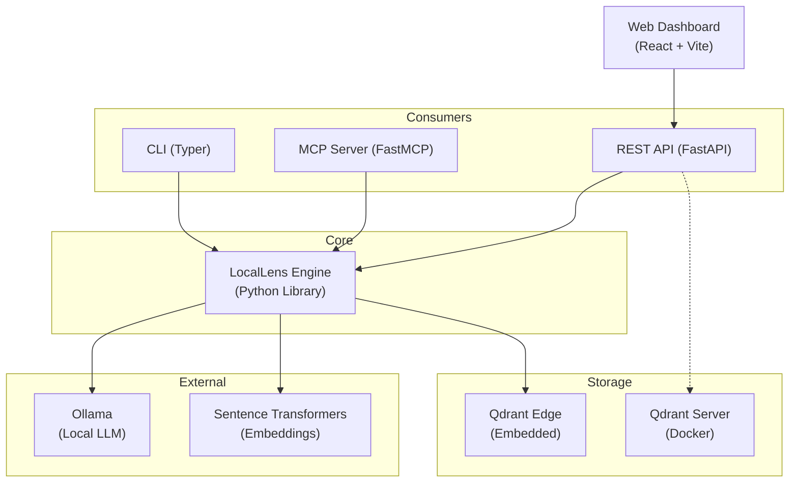

# Architecture

## Layer diagram

The **LocalLens Python library** (`locallens.engine.LocalLens`) is the center of everything. The CLI, MCP server, and REST API are all thin wrappers that call the same engine methods.

## Pipeline

Every file goes through the same 5-step pipeline:

1. **Extract** — Pull text from the file using the appropriate extractor (PDF, DOCX, code, etc.)
2. **Chunk** — Split text into ~500 character chunks with 50 character overlap. Structure-aware: respects heading boundaries in Markdown, function boundaries in code
3. **Embed** — Convert each chunk to a 384-dimensional vector using `all-MiniLM-L6-v2` (sentence-transformers)
4. **Store** — Upsert into Qdrant with deterministic point IDs (`uuid5` of `file_path:chunk_index`). Payload includes `file_path`, `file_name`, `file_type`, `chunk_text`, `chunk_index`, `file_hash`, `indexed_at`
5. **Search / RAG** — Query the vector store by semantic similarity, BM25 keywords, or hybrid (RRF fusion). For RAG, retrieved chunks become context for Ollama

## Two vector DB modes

### Qdrant Edge (embedded)

Used by the Python library and CLI. No Docker, no server process.

- Storage: `~/.locallens/qdrant_data`
- SDK: `qdrant-edge-py` (`EdgeShard`)
- Features: named vectors, keyword payload indexes, filtered search, facets

### Qdrant Server (Docker)

Used by the web dashboard's FastAPI backend.

- Storage: Docker volume at `./data/qdrant`
- SDK: `qdrant-client` over HTTP (port 6333)
- Start: `docker compose up -d qdrant`

Both modes use the same schema, so data can sync between them via `locallens sync push/pull`.

## Hybrid search

LocalLens supports three search modes:

| Mode | How it works |
|---|---|
| `semantic` | Cosine similarity between query embedding and stored chunk embeddings |
| `keyword` | BM25 scoring over tokenized chunk text |
| `hybrid` | Both semantic and BM25 results combined via Reciprocal Rank Fusion (RRF, k=60) |

Hybrid is the default and generally gives the best results — semantic similarity catches meaning while BM25 catches exact terms.

## Optional components

| Component | Purpose | Required? |
|---|---|---|
| **Ollama** | Local LLM for RAG (`ask` command) | Only for `ask` |
| **Moonshine** | Speech-to-text (voice input) | Only for `voice` |
| **Piper TTS** | Text-to-speech (voice output) | Only for `voice` |
| **Docker** | Qdrant Server for web dashboard | Only for web dashboard |

## Shared schema

Both Qdrant Edge and Qdrant Server use an identical schema:

- **Collection name:** `locallens`
- **Named vector key:** `"text"`
- **Vector dimensions:** 384 (cosine distance)
- **Payload fields:** `file_path`, `file_name`, `file_type`, `chunk_text`, `chunk_index`, `file_hash`, `indexed_at`
- **Keyword indexes on:** `file_hash`, `file_path`, `file_type`
- **Point IDs:** `uuid5(namespace, f"{abs_file_path}:{chunk_index}")`
